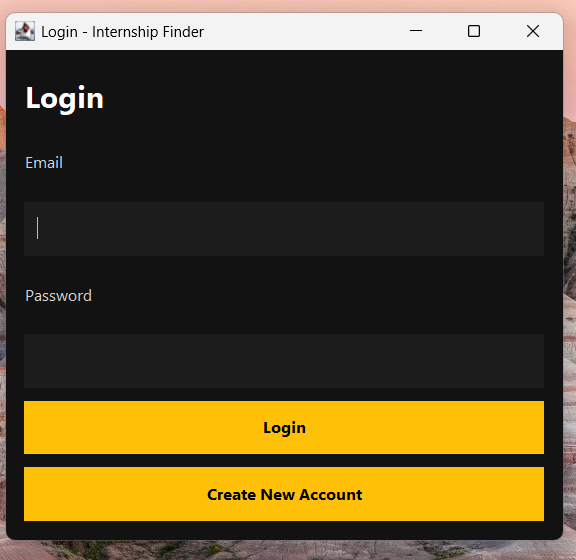
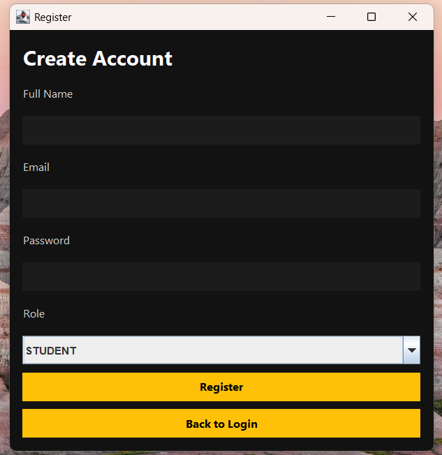
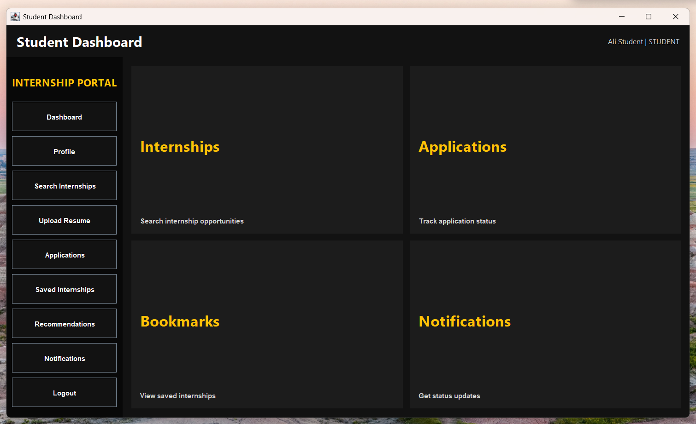
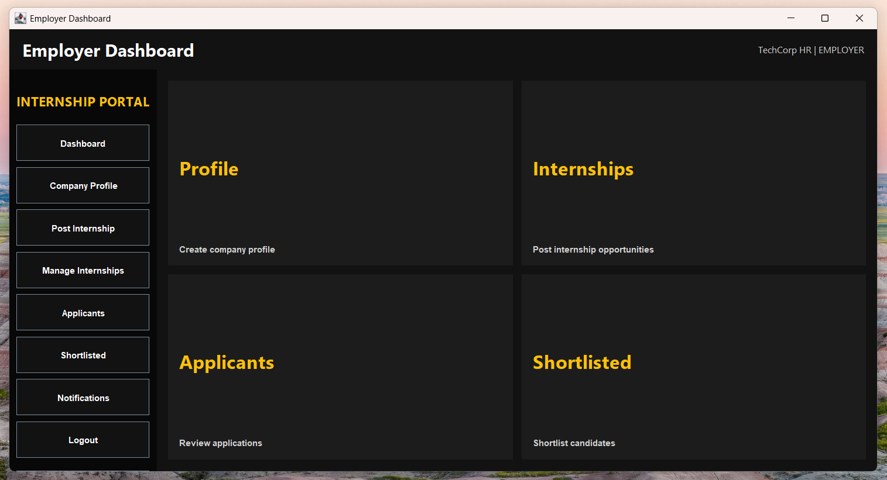
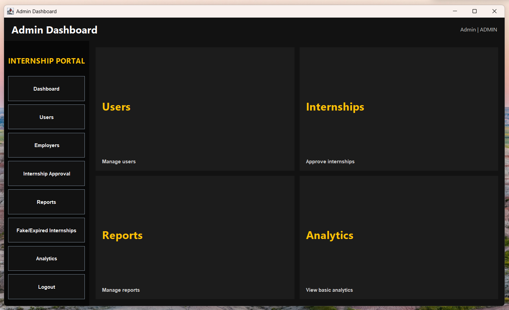
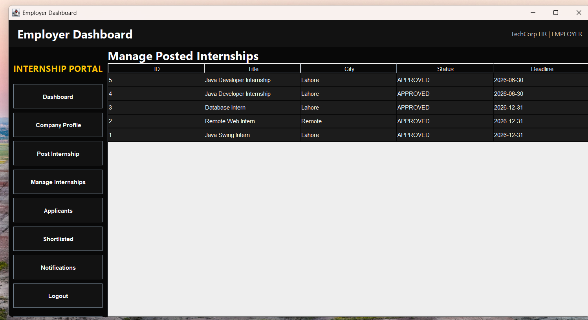
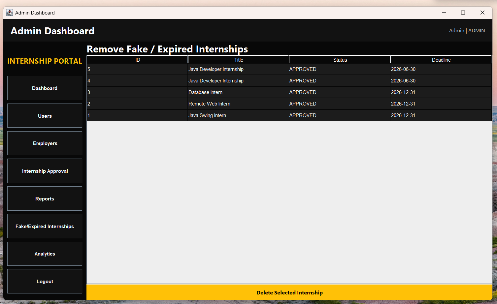

# Internship Finder System

## Overview

Internship Finder System is a Java Swing-based desktop application developed to connect students with internship opportunities while allowing employers to manage internship postings and applications. The system follows Object-Oriented Programming principles and uses a structured architecture to ensure maintainability and scalability.

## Features

### Student Module

* Student Registration & Login
* Search Available Internships
* Apply for Internships
* Track Applications
* Manage Profile Information

### Employer Module

* Employer Registration & Login
* Post Internship Opportunities
* Manage Internship Listings
* View Student Applications

### Admin Module

* Manage Users
* Manage Internship Listings
* Approve Internship Posts
* Monitor System Activity

## Technologies Used

* Java
* Java Swing
* Object-Oriented Programming (OOP)
* MVC Architecture
* JDBC
* SQL Database
* Eclipse IDE

## Project Structure

```text
src/
├── model/
├── repository/
├── utils/
├── view/
└── viewmodel/

screenshots/
README.md
```

## Screenshots

### Login Screen



### Registration Screen



### Student Dashboard



### Employer Dashboard



### Admin Dashboard



### Internship Listings



### Internship Approval




## Learning Outcomes

* Applied Object-Oriented Programming concepts
* Implemented MVC architecture
* Worked with database connectivity using JDBC
* Developed role-based authentication and authorization
* Built a complete desktop application using Java Swing

## Author

**Bisma Raza**

BS Software Engineering Student

GitHub: https://github.com/Bismaraza

## Installation & Usage

### Prerequisites

* Java JDK 8 or above
* Eclipse IDE (recommended)
* JDBC Driver
* SQL Database

### Steps to Run

1. Clone the repository:

```bash
git clone https://github.com/Bismaraza/Internship-Finder-System.git
```

2. Open the project in Eclipse IDE.

3. Configure the database connection in the database configuration file.

4. Import the required database schema.

5. Run the main Java file.

### User Roles

* Student
* Employer
* Admin

### Features Available

* User Authentication
* Internship Management
* Application Tracking
* Admin Controls
* Dashboard Management

